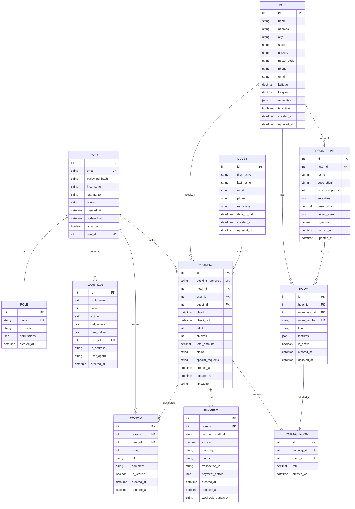

# Hotel Booking System - Entity Relationship Diagram

## Key Relationships

1. **User Management**: Users have roles with permissions, can make bookings and write reviews
2. **Hotel Structure**: Hotels contain room types and individual rooms
3. **Booking Flow**: Users book rooms through bookings, which can include multiple rooms
4. **Payment Processing**: Each booking can have multiple payments
5. **Guest Management**: Separate guest information for actual occupants
6. **Audit Trail**: Complete audit logging for all changes
7. **Reviews**: Users can review their bookings after completion
