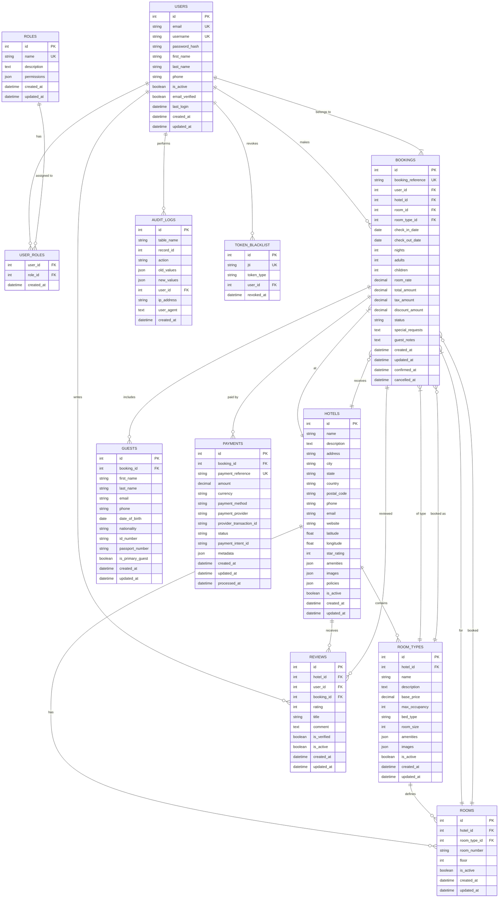

# Hotel Booking System - Entity Relationship Diagram

## Database Schema ER Diagram

## Database Schema Description

### Core Entities

1. **USERS** - User accounts with authentication and profile information
2. **ROLES** - User roles for authorization (admin, manager, guest, etc.)
3. **HOTELS** - Hotel information including location, amenities, and policies
4. **ROOM_TYPES** - Room categories with pricing and specifications
5. **ROOMS** - Individual rooms within hotels
6. **BOOKINGS** - Reservation records with dates, pricing, and status
7. **GUESTS** - Guest information for each booking
8. **PAYMENTS** - Payment transactions and processing details
9. **REVIEWS** - Hotel reviews and ratings from guests
10. **AUDIT_LOGS** - Change tracking for security and compliance

### Key Features

- **Normalized Design**: Proper foreign key relationships and data integrity
- **Audit Trail**: Complete change tracking with user attribution
- **Flexible Pricing**: Support for dynamic pricing and discounts
- **Multi-currency**: Payment support for different currencies
- **Role-based Access**: Granular permissions system
- **Concurrency Control**: Optimistic locking for booking conflicts
- **Timezone Awareness**: Proper date/time handling for international bookings
- **Payment Integration**: Ready for Stripe and other payment providers
- **Review System**: Verified reviews linked to actual bookings
- **Security**: JWT token blacklisting and comprehensive logging

### Indexes and Constraints

- **Unique Constraints**: Booking references, payment references, room numbers per hotel
- **Check Constraints**: Valid dates, positive amounts, rating ranges
- **Indexes**: Optimized for common queries (dates, status, user lookups)
- **Foreign Keys**: Maintain referential integrity across all relationships
